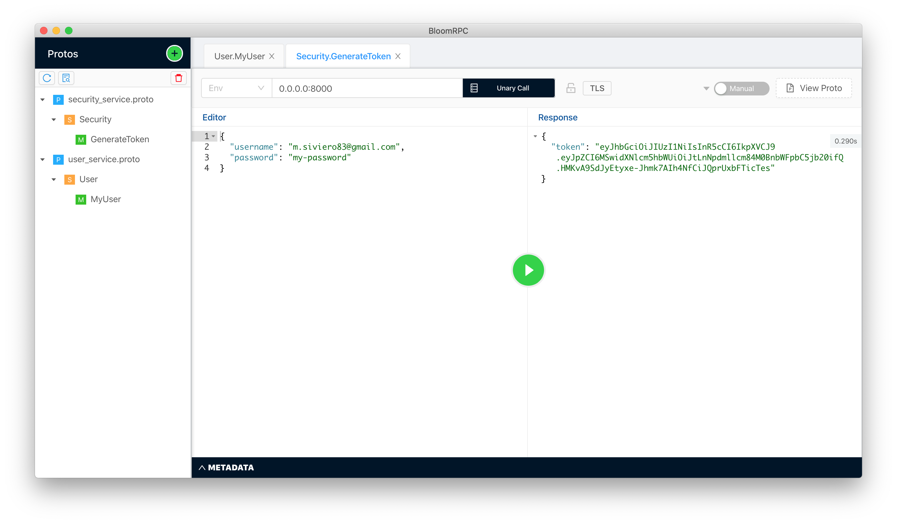
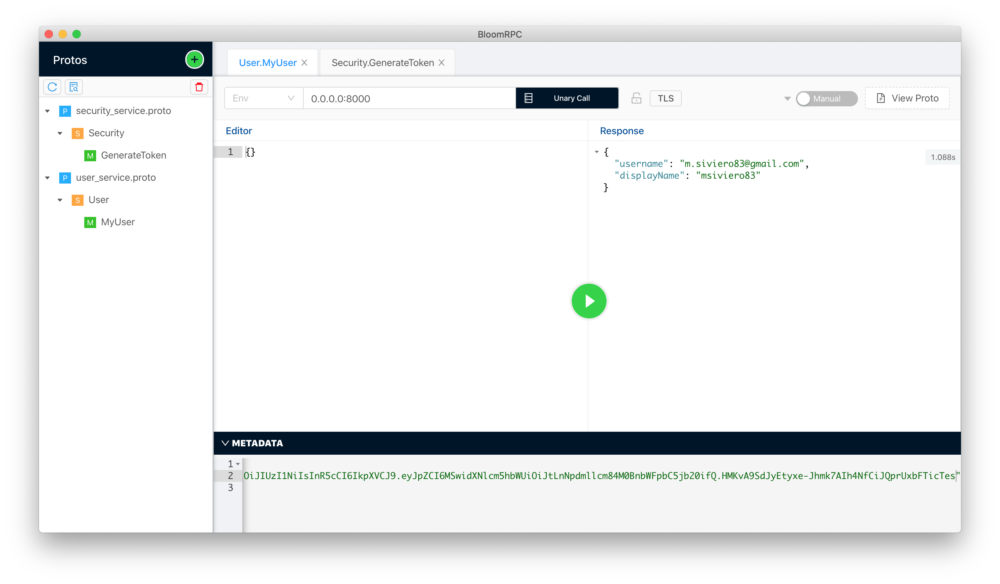

# About this project

This project is a proof of concept study to throw a base on which the team can build the future java services.
In this document all the rationales behind the technical choices will be explained.

The service implements a simple api that permit to login a user and then ask another endpoint for the username, 
once authenticated.

The performances are good, as the whole app, is taking < 150mb of memory to run

#### Table of Contents

- [Project stub](#project stub)
- [Approach on libraries](#approach on libraries)
- [Approach on database](#approach on database)
- [Approach on rest calls](#approach on rest calls)
- [Dependency injection](#dependency injection)
- [Api protocol](#api protocol)
- [App usage](#app usage)
---
## Project stub

The project  (as any other choices) starts from the simplest possible solution. 
In this case, since we use gradle in the other projects the choice was to:
```shell script
gradle init
``` 
So that no manually action will be needed, in the future, to create a project (no stubs to maintain, dependencies to update and so on).

## Approach on libraries

To choose the libraries the approach is to use the base libraries for the same vendor. 
The choice was Google, because they have probably the best java developers in the world. The expectation was to have all the libraries work
together in a harmonious way. The expectation is being quite fulfilled, in the end.

The libraries used were:
- guava for base language
- auto-value for dto generation
- gson for json
- grpc for api server - client communication
- truth for assertion in testing
- flogger for logging

## Approach on database
The database used for the application is Mysql. This is due to its big community diffusion and support.
It also has plenty of simple tools to manage (the provided docker-compose includes an adminer gui, for example).

Due to the well-known performance and debugging issues for database access we avoided using hibernate, 
instead jdbc-template is used as a thin layer above JDBC.

[requery](https://github.com/requery/requery) was interesting but still a  bit immature, surely worth to take an eye on.

As general architecture a ddd-like repository approach has being used.

## Approach on rest calls
In a perfect world, when choosing grpc as the transport layer, would not be needed, but as we can't change everything together,
plus we maybe need to call third party services.

The pair retrofit + jackson proved to be a valid solution

## Dependency injection

For dependency injection the natural choice has been dagger, as we tested it in other projects with positive feedback from the team.

main benefits:
- compile time dependency resolution
- performance

## Api protocol

To expose the service to the external world, grpc protocol it's been used, instead of rest protocol.

A few benefits are:
- compile time type safety
- language interoperability
- no need to deal with json or similar serialization mechanism
- performance
- mechanism to do single request to stream, stream to single response, bidirectional stream
- integrated high performance server
- has integration with Dagger (even if I didn't have the need to use it)

The only con seen so far is the debugging, as you can't use the browser a/o curl but can be easily resolved with tools like bloomrpc, for example.
see [this repo](https://github.com/grpc-ecosystem/awesome-grpc) for more resources.

## App usage

Create a mysql server using docker
```shell script
docker-compose up
```

Build with 
```shell script
./gradlew clean build
```

Run with 
```shell script
java -jar build/libs/api-server.jar
```

Then to test it use a GRPC client (I used [BloomRpc](https://github.com/uw-labs/bloomrpc)

- Call the authentication endpoint with a valid user / password pair


- Use the retrieved token to as "Authorization" header value to fetch user info (integrated with gravatar info)

